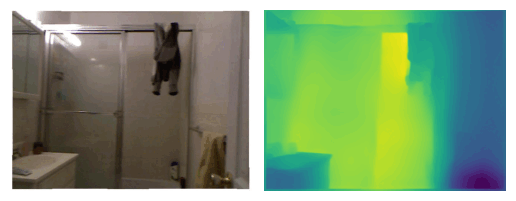
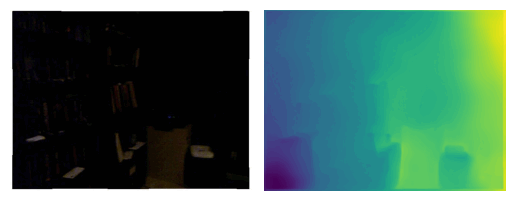

# Monocular Depth Estimation with Transfer Learning
## Introduction
This project aims to reimplement the structures and methods used in the paper "High Quality Monocular Depth Estimation via Transfer Learning" which can be found at https://arxiv.org/abs/1812.11941.
Though the original paper implements these methods using Tensorflow, I will be using Pytorch for this implementation. For training, the NYU Depth v2 dataset will be used. I decided to use a version of this dataset available on Kaggle which was already preprocessed some and separated into a train and test set. This dataset can be found at https://www.kaggle.com/datasets/soumikrakshit/nyu-depth-v2 with the original available at https://cs.nyu.edu/~fergus/datasets/nyu_depth_v2.html.
The paper proposes a U-Net like architecture with a pretrained encoder, DenseNet-169, and custom loss function which utilizes L1 loss, image gradients, and Structural Similarity.

## Difficulties
The first difficulty I encountered was that the structure of DenseNet-169 as imported from Pytorch seemed different from the specified structure in the paper. The structure of the model is given by Table 5 in the parer. Firstly, in order to follow the correct output sizes specified by the table, the skip connections seemingly had to be placed in somewhat arbitrary and unintuitive spots.
For instance, the structure of DenseNet-169 is an initial convolution with a max pooling followed by 4 denseblocks with transition layers, which also act as the pooling layers specified in the table, however, in order to follow the output shapes as given, the first skip connections must be placed after the first convolution, the second skip after the max pooling, the third after the first transition, and the fourth after the second transition.
This seemingly leaves one layer without a skip connection, and leaves the U-Net structure unbalanced. Additionally, I find it strange that a skip connection is placed immediately after the first pooling, without having any convolution operation applied to it first.
It is entirely possible, and maybe likely, that I am mistaken in where to put the skip connections, but this is what I found to follow the output sizes given in Table 5 of the paper. Ultimately I feel this should not affect the performance of the model too much as the structure still mostly follows a U-Net structure, utilizing the benefits of skip connections, even if done suboptimally. 

The second difficulty I encountered, and the biggest difficulty I had, was sudden spikes in loss. The spikes in loss happened semi-randomly, occurring within predictable intervals, for instance the first big spike in loss usually occurred between 12k - 16k iterations (when the training data was unshuffled and had a batch size of 2). This spike in loss could take the loss from being less then 1, up to a value in the hundreds.
This would cause the model to start producing inaccurate depth maps that did not correspond well to the inputs at all. This is obviously not a good thing, as it would significantly set the model back after each spike.
The nature of these spikes made me believe there was a fault with certain datapoints within the training set, however, I could not easily identify the data that was causing this, and did not feel like doing a deep dive into it to figure it out. Instead, i employed gradient clipping to prevent the model from making extreme changes when encountering sudden spikes in loss. This helped significantly, and prevented the model from producing garbage depth maps after spikes.

Additionally, the paper uses a batch size of 8, however, due to hardware constrains I use a batch size of 2.

## Results
Ultimately, my reimplementation produces similar results as specified by the paper in similar amounts of time. The performance of trained models on the test set is on par with the metrics in the paper, although slightly worse overall.

## Running Code
If you would like to run this code for yourself, download the dataset from https://www.kaggle.com/datasets/soumikrakshit/nyu-depth-v2. Once downloaded select a subset of the training data to be validation data. Remove this subset from the training set and place the filenames in a new csv called nyu2_val.csv and the images and depth maps in a new folder called nyu2_val. These should look very similar to setup given initially. At this point you should be able to run the code with minimal changes.

## Extra
Note that the depth values in the training data range between 0 and 1, while the range of the depth values in the test set is 0 to 10000. For evaluation the depth values of the true depth map will be divided by 10000.

A validation set has been made by taking from training data.

Note that the depth maps in the test set are 16-bit while the ones in train are 8-bit.